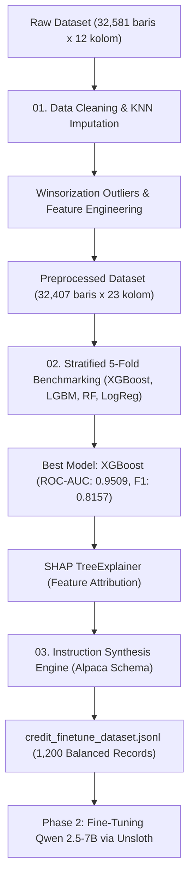

# 📑 Project Documentation Index — Local Credit Risk Assessment & XAI System

Dokumentasi ini menyajikan laporan komprehensif, metodologi langkah demi langkah (*step-by-step methodology*), hasil kuantitatif, dan analisis mendalam dari seluruh eksperimen pada direktori `notebooks/`.

---

## 🗂️ Daftar Dokumen Teknis

| No | Dokumen | Notebook Rujukan | Topik Utama |
| :---: | :--- | :--- | :--- |
| **01** | [01_eda_and_feature_engineering_report.md](./01_eda_and_feature_engineering_report.md) | `01_eda_and_feature_eng.ipynb` | Profiling Data, Pembersihan Anomali, Imputasi KNN, Capping Outlier, Rekayasa Fitur Finansial, dan Preprocessing. |
| **02** | [02_predictive_ml_and_shap_xai_report.md](./02_predictive_ml_and_shap_xai_report.md) | `02_ml_and_shap_modeling.ipynb` | Benchmarking 4 Algoritma ML, Penanganan Imbalance, Tuning XGBoost, Evaluasi ROC-AUC & F1, serta Interpretasi SHAP (Global & Local). |
| **03** | [03_synthetic_dataset_generation_guide.md](./03_synthetic_dataset_generation_guide.md) | `03_dataset_generation.ipynb` | Konsep Sintesis Dataset Instruksi (Alpaca Prompt), Penyatuan Prediksi ML + SHAP, Skema JSON Underwriting Memo, dan Format JSONL untuk QLoRA. |

---

## 🏗️ Ringkasan Alur Eksperimen End-to-End

---

## 🎯 Target Key Performance Indicators (KPI) vs Realisasi

| Metrik / Aspek | Target PRD | Hasil Eksperimen | Status |
| :--- | :---: | :---: | :---: |
| **Predictive ROC-AUC** | $\ge 0.88$ | **0.9509** | ✅ Melampaui Target |
| **Predictive F1-Score** | $\ge 0.80$ | **0.8157** | ✅ Melampaui Target |
| **Precision (Default Class)** | - | **0.8263** | ✅ Sangat Baik |
| **Recall (Default Class)** | - | **0.8054** | ✅ Sangat Baik |
| **Explainability Coverage** | 100% Top Risk Drivers | **100% SHAP Grounded** | ✅ Sesuai Spesifikasi |
| **Instruction JSON Validity** | $\ge 98\%$ | **100.0% Valid JSON** | ✅ Sempurna |
